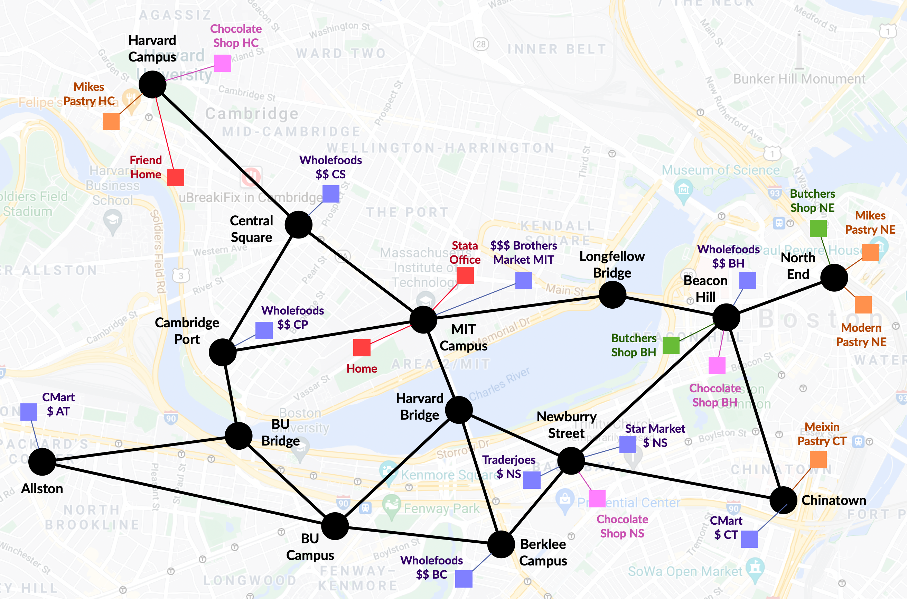

# Grocery shopping domain

The grocery shopping domain is designed where action costs depend on the mode of transportation, distance between locations, and places to shop. 

The great city of Boston is simulated:



## Types and Predicates

* Transportation happens between `location`s, which are marked either by dots or squares
* An `area`, represented by a black dot, is a large `location`. 
* Areas contain precise `location`s, which are represented by colored squares. Each precise `location` also contains a unmarked `parkinglot`, which is also of type `location`

## Action costs

#### Cost of traveling time:

* Between areas, cost of driving is 4, while cost of walking is 8
* Between an area and its locations, cost of driving or walking is 2
* Between locations in an area, cost of driving or walking is 4 = 2 + 2

#### Cost of shopping:

* In terms of pricing, `brothers-market` (1) > `wholefoods` (4) > `traderjoes`/`star-market`/`c-mart` (4), whose costs are 30, 20, 10 for each iterm respectively
* At `butchers-shop` (2), each item costs 30
* At `chocolate-shop` (3), each item costs 20
* At `pastry` (4), each item costs 10

#### Other costs:

* Cost of parking is 5 anywhere
* Costs of other operators are 1

#### Category of shopping:

* All markets sell `ingredient`
* Places that sell `utensil`: `wholefoods`, `star-market`, `cmart`
* Places that sell `lambchop`: `butchers`
* Places that sell `bread`: `pastry`
* Places that sell `alcohol`: `brothers-market`, `wholefoods`, `star-market`
* Places that sell `pasta`: `brothers-market`
* Places that sell `chocolate`: `chocolate-shop`
* `cmart` doesn't sell `seafood`
* `traderjoes` doesn't sell `baverages` 

## Experimental results on action costs

There are 9 places that sell `veggie1` and `egg1`, and 2 places that sell `lamb-chop1`

* `shop-veggie.pddl` requires purchase of `veggie1`; `shop-omelette.pddl` requires purchase of `veggies1` and `egg1`
    * `lama-firt` chose to walk to Brother's Market, which is close but expensive
    * `lama` chose to drive to Trader Joe's Newburry Street, which is farther but cheapest

* `shop-lamb-plate.pddl` requires purchase of `veggies1` and `lamb-chop1`:

    * Both chose to buy `lambchop` at Butcher's Shop Beason Hill
    * `lama-firt` chose to buy `veggie1` at Brother's Market 
    * `lama` chose to buy `veggie1` at Trader Joe's Newburry Street


```python
     t  run_name                           var    op    axiom    plan    cost    parse       search    state
------  -------------------------------  -----  ----  -------  ------  ------  -------  -----------  -------
115254  shop_veggies, pln=lama_first       148   392      170       8      75    0.089  0.00033575        11
115255  shop_veggies, pln=lama             148   392      170      18      67    0.086  0.0968291       3191
------  -------------------------------  -----  ----  -------  ------  ------  -------  -----------  -------
115255  shop_omelette, pln=lama_first      159   402      170      10     106    0.088  0.000423083       14
115256  shop_omelette, pln=lama            159   402      170      20      78    0.087  0.390508       12204
------  -------------------------------  -----  ----  -------  ------  ------  -------  -----------  -------
115256  shop_lamb_plate, pln=lama_first    154   395      172      22     310    0.089  0.000801125       28
115257  shop_lamb_plate, pln=lama          154   395      172      27     122    0.087  0.410943       12599
```

<!--
## Example problems and expected results

Note that in the following calculation of costs, the cost of the same operations are omitted (e.g., parking once, entering building).


#### `shop-veggie.pddl` requires purchase of `veggie1`:

* `lama-firt` would choose `brothers-market`, cost = 2+2 + 30 + 2+2 = 38
* `lama` would choose `wholefoods-cs` or `wholefoods-cp`, cost = 2+4+2 + 20 + 2+4+2 = 36

#### `shop-omelette.pddl` requires purchase of `veggies1` and `egg1`:

* `lama-firt` would choose `brothers-market`, cost = 2+2 + 60 + 2+2 = 68 
* `lama` would choose `traderjoes-ns` or `starmarket-ns`, cost = 2+4+4+2 + 20 + 2+4+4+2 = 44

#### `shop-lamb-plate.pddl` requires purchase of `veggies1` and `lamb-chop1`:

* `lama-firt` would choose to park at `beacon-hill`, shop at `wholefoods-bh` and `butchers-shop-bh`, cost = 2+4+4 + 5 + 2 + 30 + 2+2 + 20 + 2+4+4+2 = 83
* `lama` would choose to first shop at`traderjoes-ns` or `starmarket-ns`, then shop at `butchers-shop-bh`, parking twice and traveling further, cost = 2+4+4+2 + 5 + 10 + 2+4+2 + 5 + 30 + 2+4+4+2 = 82
-->


