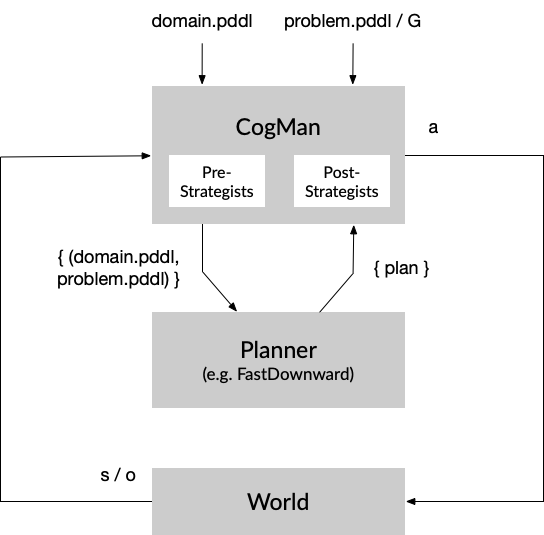

# LEAP (Learning-Enabled Abstraction for Planning)



* CogMan: cognitive manager that employs strategists and commonsense knowledge to solve big, complex problems
    * Pre-problem Strategists: a sequence of (learned) components that map a big problem into a sequence of smaller problems by making hierarchical or temporal abstractions
        * HPN: (v1) relax preconditions with fixed hierarchy (v2) with learned importance score
        * PLOI: (v1) find minimum set of objects at the beginning of solving the problem (v2) change the set dynamically
        * C2S2 (context-conditioned subgoal suggestor): (v1) with 3-gram models (v2) with language models 
    * Post-problem Strategists: a sequence of components that improve a plan 
        * VNS: to change the order of operators, e.g. open the fridge only once to get both the meat and cheese

## Usage

Run `run.py` with the domain and problem pddl files, along with the sequence of strategists to use. The code searches for the pddl files in all sub-directories of `domains/`.

```
## the general template
python run.py domain.pddl problem.pddl 
    -o 'large_domain_objects.pddl' 
    -p [fd/pp] 
    -s 'hpn,c2s2,pre-strategists separated by comma' 
    -v [0/1/2] 
    -e 'experiment_output_directory'

## this should work and generate an output dir with plan and log in experiments/dev
python run.py kitchen_1.pddl omelette_5.pddl -o obj_3.pddl -v 2 -e 'experiments/dev'

## this needs to run successfully for every new version of the code and domain files
./tests.sh
```

Note that `kitchen_3.pddl` and `obj_eggs.pddl` are currently being actively developed for a larger kitchen domain.

Helper functions:

```
## post_experiments.py prints a table of experimental stats in directory
python generators/post_experiments.py experiments/kitchen_operators

## init_objects.py converts doc/objects.md file to PDDL tuples of types and objects
python generators/init_objects.py 
```

### Available Planners

* `df`: FastDownward with lama-first. Better than PyperPlan in that it can take ADL expressions for using forall/exists/when. It also supports action costs and axioms (see `downward/driver/aliases.py` and [Doc/Evaluator](http://www.fast-downward.org/Doc/Evaluator#Landmark-count_heuristic)). But it doesn't support PDDL 2+ and 3+ features, like fluents, numerical planning, temporal planning, soft goals & preferences.

```python
ALIASES["lama-first"] = [
    "--evaluator",
    "hlm=lmcount(lm_factory=lm_reasonable_orders_hps(lm_rhw()),transform=adapt_costs(one),pref=false)",
    "--evaluator", "hff=ff(transform=adapt_costs(one))",
    "--search", """lazy_greedy([hff,hlm],preferred=[hff,hlm],
                               cost_type=one,reopen_closed=false)"""]
```

* `pp`: PyperPlan with Greedy Best First Search and FF heuristic

### Available Strategists

* `hpn`, `ploi` or `c2s2`: output the original domain and problem pddl


## Domains

You may find more classic IPC domains in [FF Domain Collection](https://fai.cs.uni-saarland.de/hoffmann/ff-domains.html) and [IPC2018 domains](https://bitbucket.org/ipc2018-classical/domains/src/master/).

### Kitchen domain

```
    (exist-egg-in-hole ?x - env)
    (exist-poached-egg ?x - env)
    (exist-baked-egg ?x - env)
    (exist-boiled-egg ?x - env)
    (exist-deviled-egg ?x - env)
    (exist-cloud-egg ?x - env)
    (exist-quiche ?x - env)
```

---

## Experiments

Write your test script like `test_goals.sh` with all test cases. 

You can also add the following lines to `tests.sh`:

```
chmod +x test_something.sh
./test_something.sh
```
